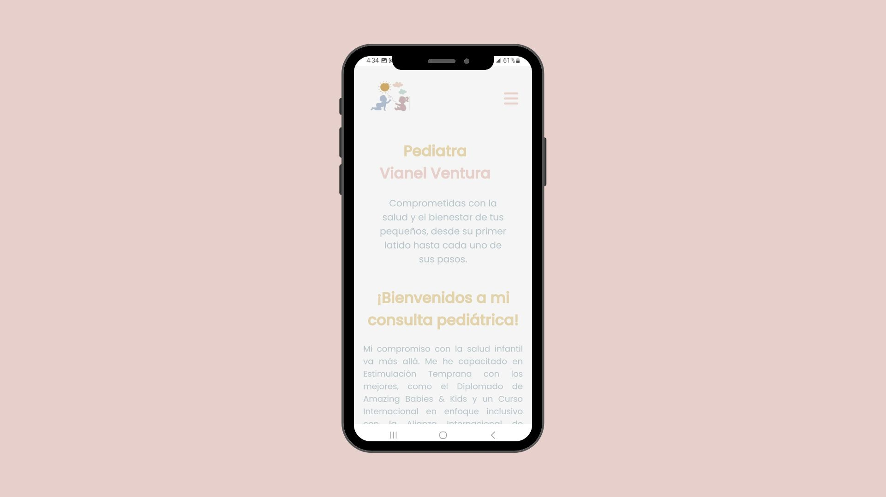

# 👩‍⚕️ Landing Page de Vianel Ventura - Pediatra

Este proyecto es una **landing page moderna y profesional** desarrollada para la pediatra **Vianel Ventura**. La página está diseñada para ser visualmente atractiva, completamente responsiva y con animaciones que mejoran la experiencia del usuario. Se ha desarrollado utilizando **HTML, CSS y JavaScript**, con un enfoque en la simplicidad y la funcionalidad.

## 📝 Descripción del Proyecto

La landing page tiene como objetivo proporcionar información clara y concisa sobre los servicios médicos ofrecidos por la pediatra Vianel Ventura. Además de destacar sus especialidades, la página está diseñada para ser completamente accesible desde cualquier dispositivo, ofreciendo una experiencia de navegación fluida y moderna.

### ⚙️ Funcionalidades Clave

- **Diseño moderno y profesional**: El diseño está enfocado en una presentación limpia y atractiva que refleja la calidad de los servicios ofrecidos.
- **Totalmente responsiva**: La página se adapta a cualquier tipo de dispositivo, incluyendo móviles, tablets y ordenadores de escritorio, garantizando una excelente experiencia en todas las plataformas.
- **Animaciones interactivas**: Se han integrado animaciones suaves y transiciones que mejoran la experiencia del usuario y hacen la navegación más dinámica.
- **Optimización SEO**: El sitio ha sido optimizado para mejorar el posicionamiento en motores de búsqueda, lo que ayuda a aumentar la visibilidad online.

## 🚀 Tecnologías Utilizadas

- **HTML5**: Proporciona la estructura semántica del contenido.
- **CSS3**: Estilización moderna y responsiva utilizando flexbox y grid.
- **JavaScript**: Mejora de la interactividad y funcionalidad de la página.
- **Animaciones CSS**: Uso de animaciones para transiciones suaves y un diseño más atractivo.

## 🌐 Características Adicionales

- **Diseño centrado en el usuario**: Navegación intuitiva y fácil acceso a la información sobre los servicios pediátricos.
- **Optimización para dispositivos móviles**: La página ha sido testeada en múltiples dispositivos para asegurar una experiencia sin fallos.
- **Animaciones suaves**: Las animaciones CSS mejoran la interactividad y captan la atención de los usuarios sin ser intrusivas.

## 🌐 Enlace a la Web

Puedes acceder a la landing page de la pediatra Vianel Ventura aquí:

👉 [**Visitar sitio web**](https://dravianelventura.azurewebsites.net/) 👈

## 📷 Capturas de Pantalla

  
  

